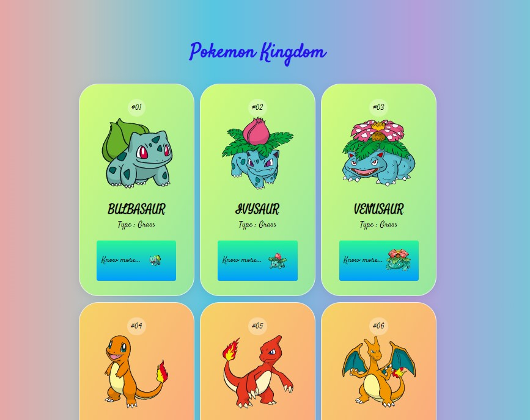
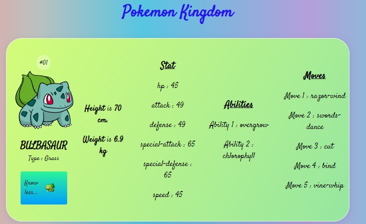

# Pokemon Kingdom - React App



Welcome to Pokemon Kingdom, a React web application that allows you to explore information about various Pokemon species. This project uses the PokeAPI to fetch and display Pokemon data.

The original code was forked from [Megh2507 - Pokemon-App](https://github.com/Megh2507/Pokemon-App).

## Table of Contents

- [Features](#features)
- [Getting Started](#getting-started)
- [Usage](#usage)
- [Contributing](#contributing)
- [License](#license)


## Features

- View a list of Pokemon with their names, images, types, heights, weights, and abilities.
- Load more Pokemon to explore additional species.
- Click on a Pokemon to view more details, including their stats and moves.

- Responsive design for a seamless experience on various screen sizes.

## Getting Started

Follow these instructions to get a copy of the project up and running on your local machine for development and testing purposes.

### Prerequisites

- Node.js and npm (Node Package Manager) installed on your machine.

### Installation

1. Clone the repository:

   ```bash
   git clone https://github.com/your-username/pokemon-kingdom.git


2. Navigate to the project directory:

   ```bash
   cd pokemon-kingdom
   ```

3. Install the project dependencies:

   ```bash
   npm install
   ```

### Usage

1. Start the development server:

   ```bash
   npm start
   ```

2. Open your web browser and visit [http://localhost:3000](http://localhost:3000) to access the application.

### Contributing

Contributions are welcome! If you'd like to contribute to this project, please follow these guidelines:

1. Fork the project on GitHub.
2. Create a new branch for your feature or bug fix.
3. Make your changes and commit them with clear and concise commit messages.
4. Push your changes to your forked repository.
5. Submit a pull request to the original repository.

